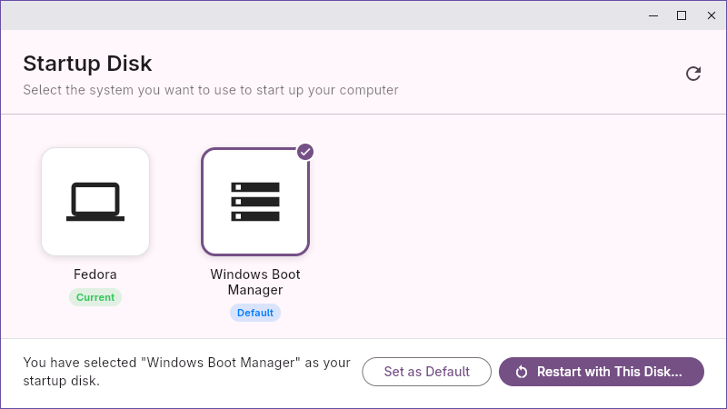

# Startup Disk

The Startup Disk app from macOS's System Preferences now available for Windows 
and Linux (requires UEFI boot). 

- Reboot to another operating system
- Change default operating system on startup

This app was created as getting a Linux boot loader (GRUB, systemd-boot) to
have the option to boot Windows (and vice-versa) in a Secure Boot enabled
system is a pain. 

This is a good compromise.

## Development

This project uses Flutter for the UI and Rust for the native code which
interact with EFI variables.

On *nix, we use `efibootmgr` as writing EFI variables requires root permissions.

On Windows, we require administrator access as reading/writing EFI variables 
require elevation.

[rinf] is used for connecting Rust and Flutter.

[rinf]: https://github.com/cunarist/rinf  

## Unlicense

This is free and unencumbered software released into the public domain. 
See [UNLICENSE].

[UNLICENSE]: ./UNLICENSE
